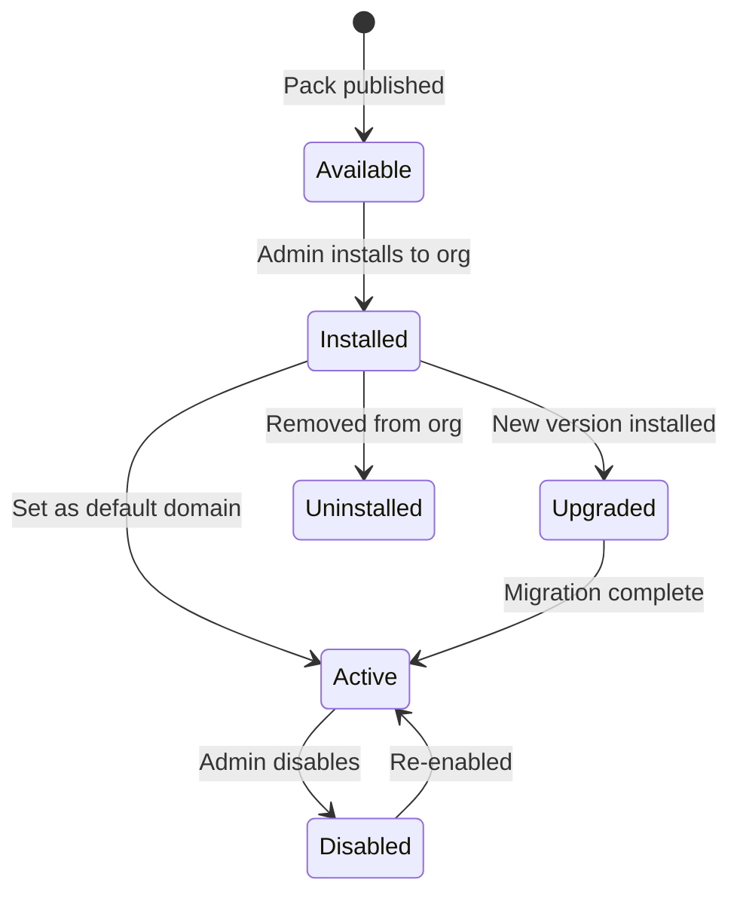

# ADR-002: Domain Pack Plugin Contract

| Field | Value |
|-------|-------|
| **Status** | Accepted |
| **Date** | 2026-06-28 |
| **Deciders** | Architecture Team |
| **Supersedes** | — |

## Context

ParsLex must support multiple legal domains (Oil & Gas, Banking, Insurance, Labor Law, etc.) without modifying core platform code. The first customer requires **Iranian Oil & Gas** specialization, but Oil & Gas logic must never be embedded in shared modules.

We need a **formal plugin contract** for domain knowledge packs that defines:

- What a pack contains
- How the core discovers and loads packs
- Versioning, validation, and upgrade semantics
- Extension points for prompts, rules, ontologies, and corpora

## Decision

Introduce **Legal Domain Packs** as versioned, declarative artifacts installed via the admin platform. Packs are **data + configuration only**; executable logic in packs is limited to declarative rules (YAML/JSON), not arbitrary code execution.

### Pack identity

```yaml
id: iran-oil-gas          # immutable slug
version: 1.0.0            # semver
display_name:
  en: "Iranian Oil & Gas"
  fa: "نفت و گاز ایران"
languages: [fa, en]
min_platform_version: "0.1.0"
```

### Required pack structure

```text
{knowledge_pack_id}/
├── manifest.yaml           # Pack metadata & capability declaration
├── ontology/
│   ├── document-types.yaml
│   ├── clause-types.yaml
│   └── obligation-types.yaml
├── regulations/
│   └── inventory.yaml      # Curated corpus catalog (not raw law files in repo)
├── templates/
│   └── inventory.yaml      # Template catalog with metadata
├── prompts/
│   └── overlays/           # Domain-tuned prompt fragments per task
├── rules/
│   ├── compliance.yaml
│   └── scoring.yaml
└── benchmarks/
    ├── qa-golden.json
    └── analysis-golden.json
```

### Manifest schema (summary)

The canonical JSON Schema lives at [`knowledge/schemas/pack-manifest.schema.json`](../../knowledge/schemas/pack-manifest.schema.json).

Key manifest sections:

| Section | Purpose |
|---------|---------|
| `capabilities` | Declares which platform features this pack extends |
| `ontology_refs` | Paths to ontology files |
| `corpora` | Regulation/template inventories |
| `prompt_overlays` | Task → overlay file mapping |
| `rules` | Compliance and scoring rule file paths |
| `benchmarks` | Golden evaluation datasets for CI |

### Capability flags

Packs declare supported capabilities; core modules check flags before applying pack extensions:

```yaml
capabilities:
  - knowledge_import
  - rag_retrieval
  - clause_classification
  - compliance_check
  - contract_generation
  - bilingual_output
```

### Core integration points

The platform exposes these **pack-aware interfaces** (implemented in core, extended by pack data):

| Interface | Pack contribution | Core responsibility |
|-----------|-------------------|---------------------|
| `DomainPackLoader` | Reads manifest, validates schema | Caches loaded packs per org |
| `OntologyRegistry` | Clause/document types | Merges with base ontology |
| `PromptComposer` | Overlay fragments | Base prompt + overlay merge |
| `ComplianceRuleEngine` | YAML rules | Evaluates against extracted clauses |
| `TemplateCatalog` | Template inventory | Resolves templates for generation |
| `RetrievalFilter` | Domain metadata filters | Scoped hybrid search |

**Rule:** Core services depend on abstractions (`OntologyRegistry`, `PromptComposer`, etc.). They never import `iran-oil-gas` directly.

### Pack lifecycle



1. **Validate** — `pack-cli validate` checks manifest against JSON Schema, ontology consistency, benchmark format
2. **Install** — Admin uploads pack bundle (zip/tar) or selects from internal registry
3. **Activate** — Workspace or project binds to a `LegalDomain` referencing the pack
4. **Upgrade** — Semver rules: patch = safe; minor = new templates/rules; major = breaking ontology changes
5. **Uninstall** — Soft-disable; corpora references remain read-only for audit

### Versioning rules

- **Pack version** (semver): independent of platform version
- **`min_platform_version`**: pack refuses to load if platform is older
- **Ontology changes**: minor = additive types; major = renamed/removed types require migration script
- **Prompt overlays**: versioned within pack; pinned per environment in admin config

### Security constraints

- Packs **must not** contain executable binaries or scripts run by the platform
- Rules are **declarative** (JSON Logic or custom YAML DSL evaluated by trusted core interpreter)
- Template files (DOCX) are stored in object storage; manifest references checksums
- Pack installation requires `platform:admin` role; logged to audit trail

### Multi-pack behavior

- An organization may install multiple packs
- Each workspace/project selects one **active domain** for AI scope
- Cross-domain retrieval is **opt-in** and explicitly scoped in `AISession`

### First pack: `iran-oil-gas`

Initial pack scope (v1.0.0):

- Contract types: EPC, procurement, service, equipment supply, NDA, JV, tender
- Clause ontology: payment, liability, force majeure, confidentiality, jurisdiction, warranties
- Compliance rules for common public procurement patterns
- Bilingual (fa/en) template inventory placeholders

## Consequences

### Positive

- New domains ship as packs without core releases
- Clear contract for pack authors and QA (benchmarks bundled)
- Ontology and rules are inspectable by legal SMEs
- Supports air-gapped pack distribution as signed bundles

### Negative

- Complex behavior must be expressed declaratively or deferred to core features
- Pack authors need tooling (`pack-cli`) and documentation
- Ontology breaking changes require careful migration

### Alternatives considered

| Alternative | Rejected because |
|-------------|------------------|
| Domain-specific microservices | Operational overhead; tight deployment coupling |
| Pack code plugins (Python wheels) | Security risk; harder air-gap review |
| Single monolithic config file | Unmaintainable at scale |

## Related ADRs

- ADR-001: On-Premise Deployment Topology
- Future ADR-005: Compliance Rule DSL
